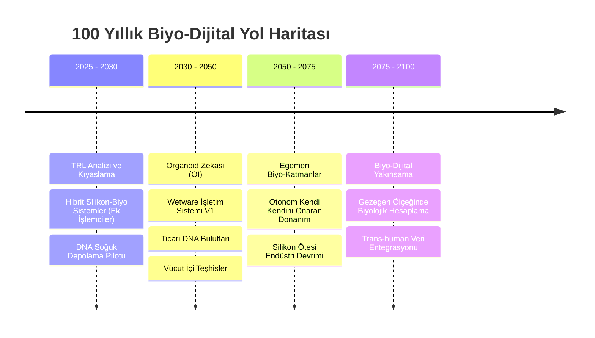

# 👁️ SİLİKON ÖTESİ MANİFESTO | VİZYON 2100

## Silikon'dan Çıkış (Exodus)

Hesaplama tarihi, materyaller arasında bir yolculuk olmuştur: dişlilerden vakum tüplerine, oradan silikona. Şimdi ise **Biyolojik Çıkış**'ın eşiğindeyiz. Elektronların fiziksel kısıtlamaları —ısı, boyut ve kuantum tünelleme— zekayı en verimli konağına dönmeye zorluyor: **Canlı Sistemler**.

### 🏛️ Biyo-Egemenliğin Üç Sütunu

1.  **Moleküler Aşkınlık:** Veri depolamayı uçucu manyetik durumlardan DNA'nın moleküler stabilitesine taşımak. Zeka artık *güç verdiğimiz* bir şey değil, gerçekliğin dokusunda *var olan* bir şey olacak.
2.  **Bilişsel Sentez:** "Yapay Zeka"dan "Sentezlenmiş Yaşam"a geçiş. Amacımız insan benzeri makineler değil, karmaşıklığımızı biyolojik verimlilikle yöneten makine benzeri organizmalardır.
3.  **Egemen Genetik Katman:** Yaşamın araçlarını kontrol etmek, egemenliğin en üst formudur. Geleceğin ulusları, kültürlerini ve mantıklarını biyolojik ortamda arşivleme yetenekleriyle tanımlanacaktır.

### 🛣️ Taktiksel Zaman Çizelgesi (Yüzyıllık Görünüm)

---

## 🔬 Temel Stratejik Alanlar

### 1. Wetware İşletim Sistemleri (WOS)
Windows ve Linux'un silikonu yönettiği gibi, WOS da hücresel metabolik yolakları yönetecektir. "Kernel" operasyonlarının **CRISPR-Cas9** kesintileriyle (interrupts) gerçekleştirildiği ve bellek yönetiminin **Peptit Katlanması** ile sağlandığı bir sistem teorize ediyoruz.

### 2. Biyolojik Bulut Altyapısı
Veri merkezleri ısı üreten depolardan; kendi kendini soğutan, besin maddeleriyle sürdürülen "Alg Havuzları" veya "DNA Kasaları"na evrilecektir. Bu, küresel veride enerji krizinin sonu anlamına gelir.

---

*"Geleceği tahmin etmiyoruz; onu var oluşun en temel hücrelerine kodluyoruz."*
