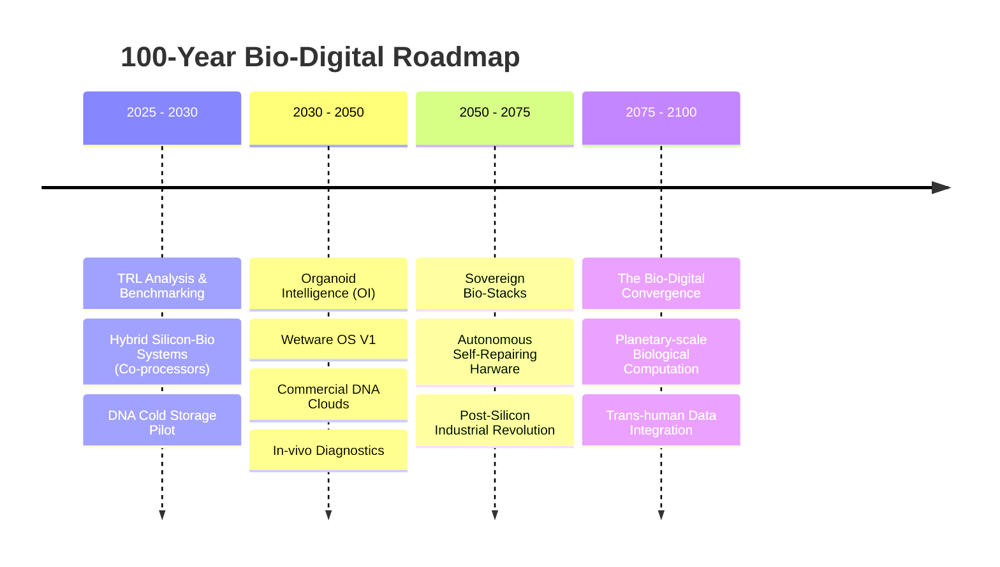

# 👁️ THE POST-SILICON MANIFESTO | VISION 2100

## The Exodus from Silicon

The history of computation has been a journey through materials: from gears to vacuum tubes, to silicon. We are now at the precipice of the **Biological Exodus**. The physical constraints of electrons—heat, size, and quantum tunneling—are forcing intelligence to return to its most efficient host: **Living Systems**.

### 🏛️ The Three Pillars of Bio-Sovereignty

1.  **Molecular Transcendence:** Moving data storage from volatile magnetic states to the molecular stability of DNA. Intelligence will no longer be something we *power*, but something that *exists* in the substrate of reality.
2.  **Cognitive Synthesis:** Transitioning from "Artificial Intelligence" to "Synthesized Life." We don't aim for human-like machines, but for machine-like organisms that handle our complexity with biological efficiency.
3.  **The Sovereign Genetic Stack:** Controlling the tools of life is the ultimate form of sovereignty. Future nations will be defined by their ability to archive their culture and logic in the biological medium.

### 🛣️ The Tactical Timeline (Century View)

---

## 🔬 Core Strategic Domains

### 1. Wetware Operating Systems (WOS)
Just as Windows and Linux manage silicon, the WOS will manage cellular metabolic pathways. We are theorizing a system where "Kernel" operations are performed via **CRISPR-Cas9** interrupts and memory management is handled by **Peptide Folding**.

### 2. Biological Cloud Infrastructure
Data centers will evolve from heat-producing warehouses into self-cooling, nutrient-sustained "Algae Pools" or "DNA Vaults." This marks the end of the energy-crisis for global data.

---

*"We do not predict the future; we code it into the very cells of existence."*
